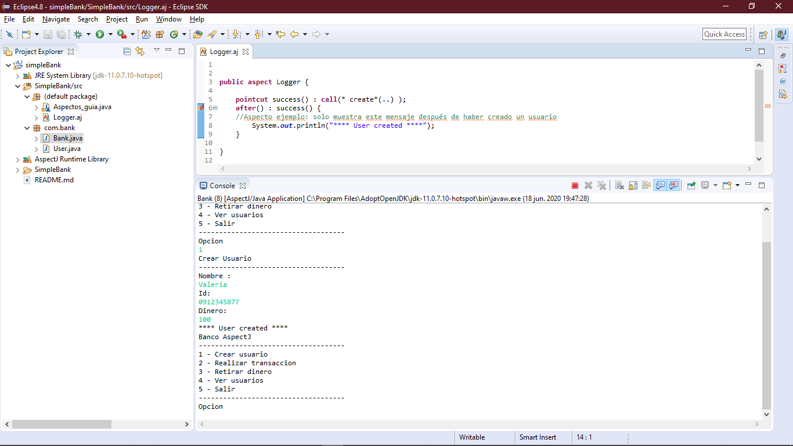
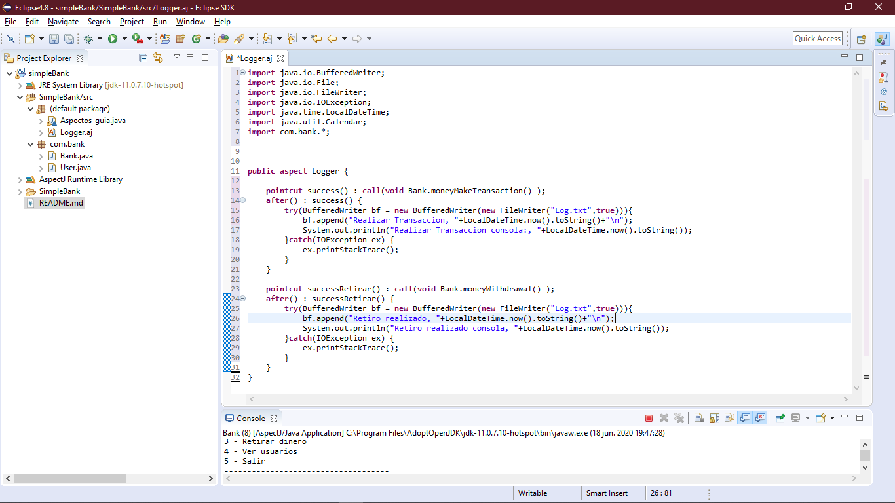

# simpleBank

Taller2 de la materia Diseño de Software

## Capturas 📷

Captura de como funciona el aspecto de "usuario creado":

    

Captura de nuestro aspecto:

    

## Integrantes 🎯

- Alex Velez **correo:** alanvele@espol.edu.ec
- Valeria Barzola **correo:** valeriadba.28@gmail.com
- Carlos Loja **correo:** caloja@espol.edu.ec
- Eddo Alvarado **correo:** eaalvara@espol.edu.ec
- Jaime Pizarro **correo:** japibaro@espol.edu.ec
